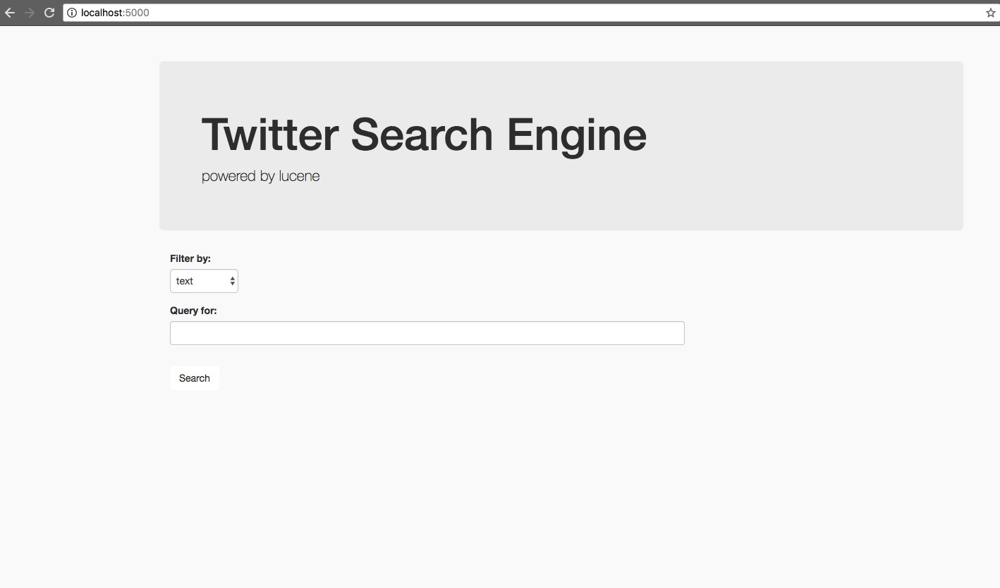
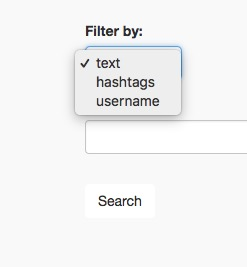
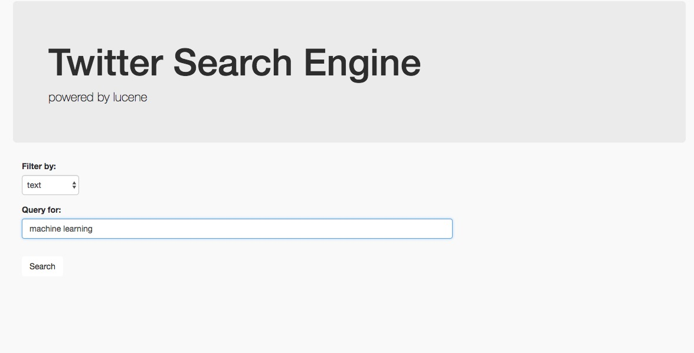
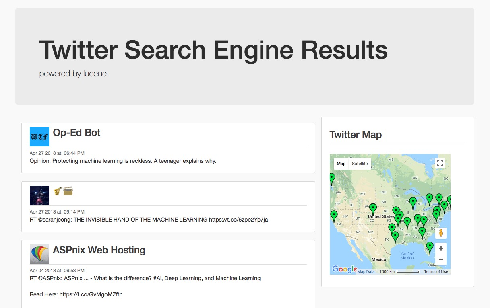
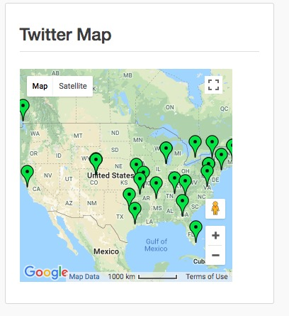
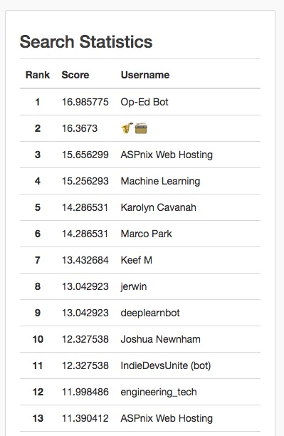

# Twitter Search Engine
##  Initial Setup
>  ### Twitter Streaming API
-  Get twitter __Consumer_Key__, __Consumer_Secret__ and copy & paste it into __TwitterSearchEngine/scrapper/authenicate.py__ file

-  Next get twitter __Access_token__, and twitter __Access_secret__ and save its in __.bashrc__ as __"TWITTER_ACCESS_TOKEN"__ and __"TWITTER_ACCESS_SECRET"__. 
- save in __.bash_profile if__ on mac

> ### Install Python requirements
```bash
cd /path/to/TwitterSearchEngine/
```
```bash
pip install -r requirements.txt
```
## How to Run Terminal Search
- You will first need to scrap tweets, index the tweets then be able to search them.
> ### Twitter Scrapper
```bash
cd path/to/TwitterSearchEngine/scrapper
```
```bash
python streaming_twtr_scrap.py
```
This will scrap tweets into a .json file and place it into TwitterSearchEngine/Data file

> ### IndexCreator
```bash
cd path/to/TwitterSearchEngine/
```
```bash
javac IndexCreator.java
```
```bash
java IndexCreator
```
This will create lucene indices that will be saved in the __TwitterSearchEngine/indices__ folder for later searching
> ### Searcher
```bash
cd path/to/TwitterSearchEngine/
```
```bash
javac Searcher.java
```
```bash
java Searcher -q <query string> -f <index field>
```
## How to Run Web Search
-  Assuming you have alreadyScrapped and indexed tweets, as shown above.
> ### Flask Server
```python
python app.py
```
> ### Twitter Search Engine


> ### Select filter

> ### Search

> ### Results

> ### Twitter Map has location of users
- Hover over to see username and profile picture


> ### Search Statistics



## Requirements
> ### Python
-  Tweepy
-  Flask
-  Flask-WTF

> ### Java
-  lucene
-  Command-cli
-  simple-JSON
